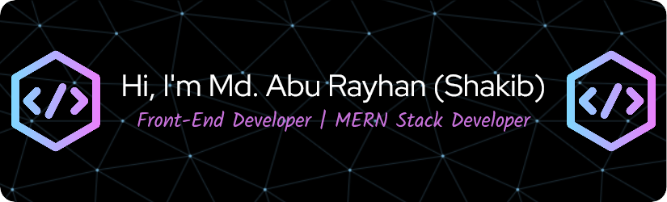

# 👋 Hi, I'm Md. Abu Rayhan (Shakib) – Front-End Developer | MERN Stack Developer

---

## 👨‍💻 About Me

I'm a passionate Front-End Developer from Bangladesh, focused on building clean, scalable web apps. I'm actively learning Full Stack Web Development using the MERN Stack and exploring Next.js to build dynamic, fast, and responsive applications.

🔭 I’m currently working on:
- 🚀 **E-Bikolpo** – A product recommendation platform using React, Firebase & Node.js  
- 🏠 **Roommate Finder Web App** – Built with Swiper, Lottie animations, and Firebase Auth

🌱 Currently exploring **Next.js**, **TypeScript**, and **Redux**

---

## 🚀 Tech Stack

  

---

## 🌐 Connect With Me

  
  

---

## 📊 GitHub Stats

  
  

